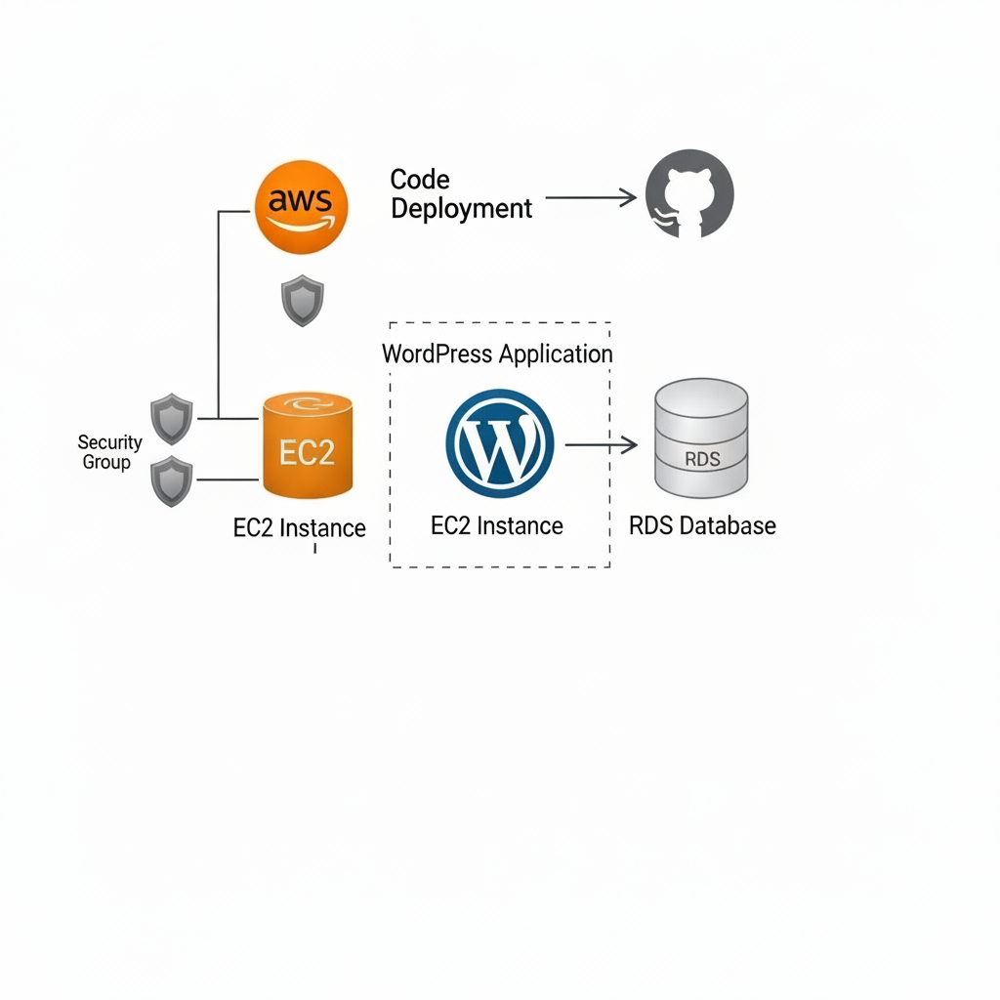
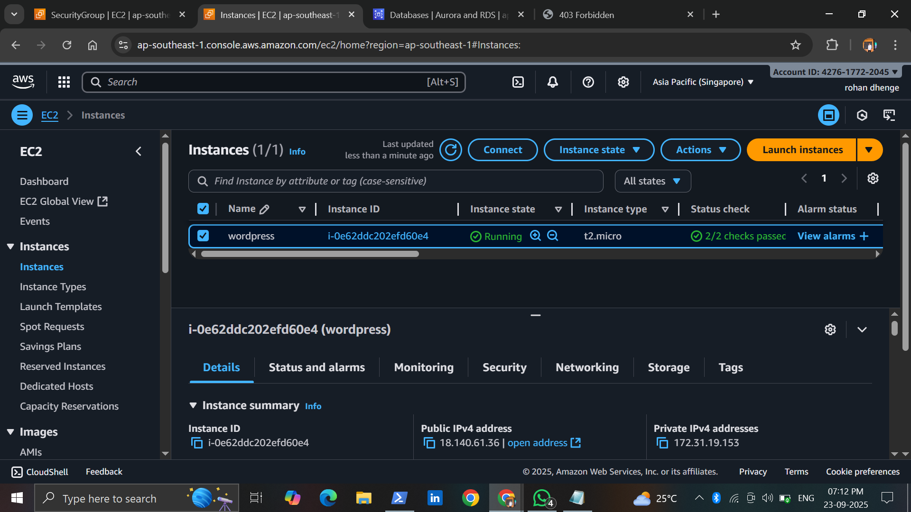
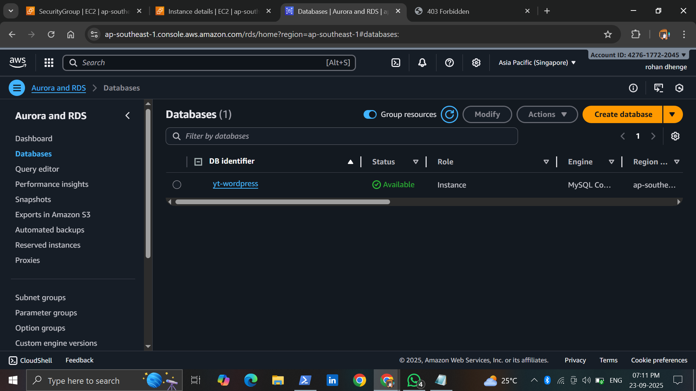

# Building Wordpress Website With EC2 & RDS
## Introduction
This project demonstrates how to deploy a WordPress website using Amazon EC2 for the web server and Amazon RDS for the MySQL database.
The setup follows a scalable and production-ready architecture where the database is decoupled from the web server, ensuring better performance, security, and maintainability.

##  Architecture Overview

🏗 Architecture

EC2 Instance → Hosts Nginx, PHP, and WordPress files

RDS Instance (MySQL) → Stores WordPress database separately

Security Groups → Control traffic (HTTP/HTTPS to EC2, MySQL only from EC2)

## 1. Launch EC2 Instance

Amazon Linux 

Install Nginx, PHP, MySQL client

Download and configure WordPress in /usr/share/nginx/html

## 2. Launch RDS Instance

Engine: MySQL (Free Tier: db.t2.micro)

Create database wordpressdb

Create user wp_user with strong password

Allow inbound MySQL (3306) traffic only from EC2 Security Group

## 3. Setup and Test

Restart Nginx.

Visit EC2 public IP → WordPress installation page should appear.

Set site name, admin user, password.

## 4. Configure WordPress

Update wp-config.php in EC2 with RDS details:

define('DB_NAME', 'wordpressdb');
define('DB_USER', 'wp_user');
define('DB_PASSWORD', 'YourPassword');
define('DB_HOST', 'yt-wordpress.c32yqweg2qug.ap-southeast-1.rds.amazonaws.com');

 
## 5. Complete WordPress Setup

Restart nginx

Open EC2 Public IP → WordPress installation page

Set Site Title, Admin User, and Password

## 🛠 Technologies Used

AWS EC2 – Compute for hosting WordPress

AWS RDS (MySQL) – Managed database service

Nginx – Web server

PHP – Backend for WordPress

WordPress CMS – Website platform

